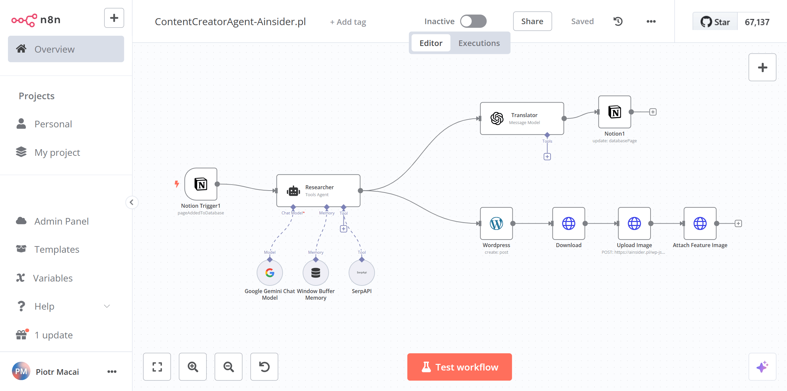

# n8n Content Creator Agent for WordPress and Other CMSs

## Overview

The n8n Content Creator Agent is a powerful automation tool designed to streamline content creation and management for WordPress and other Content Management Systems (CMSs). This agent leverages n8n, a popular workflow automation tool, to integrate various services and automate repetitive tasks, allowing content creators to focus on what they do best—creating content.

## Features

- **Automated Content Publishing**: Automatically publish content to WordPress and other CMSs.
- **Multilingual Support**: Translate content into multiple languages using integrated translation services.
- **Content Research**: Utilize AI models to research and generate content ideas.
- **Image Handling**: Download, upload, and attach feature images to your posts.
- **Customizable Workflows**: Easily customize workflows to fit your specific content creation needs.

