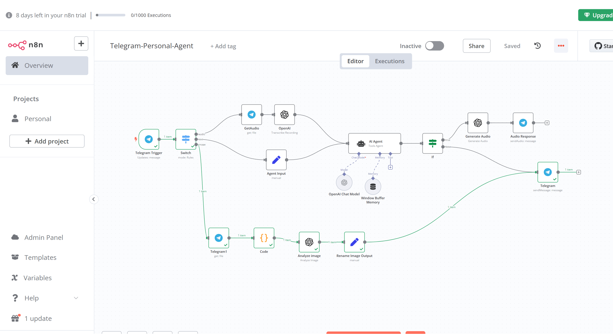

This n8n AI Agent is a powerful, ready-to-use automation template that enables a multimodal AI assistant with:

✅ Text Input & Output (via Telegram)

✅ Voice Input & Output (speech-to-text and text-to-speech processing)

✅ Image Recognition (AI-powered image analysis and response generation)

✅ Seamless Integration with OpenAI API

✅ Memory Buffer for Contextual Conversations

🎯 Features

Telegram Integration: The agent communicates via Telegram, allowing easy access on any device.

Text & Voice Processing:

Handles text messages with AI-powered responses.

Supports voice input using OpenAI Whisper for transcription.

Generates audio responses using AI text-to-speech.

Image Recognition:

Accepts images via Telegram.

Uses OpenAI’s Vision API (or other providers) to analyze and describe images.

Returns insightful AI-generated responses.

Conversational Memory: Implements a buffer memory for contextual replies.
