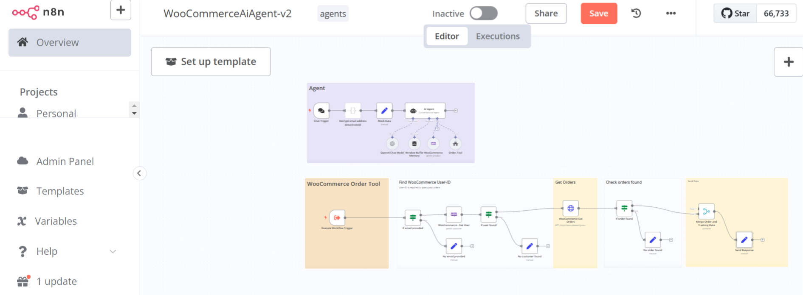

# README: n8n AI Agent for WooCommerce Recommendation and Order Checker

## Overview

This repository contains an **n8n AI Agent** designed to enhance your WooCommerce store by providing **product recommendations** and **order tracking** functionalities. The agent integrates with WooCommerce APIs and uses AI to validate users, recommend products, and check order statuses. Built on the n8n workflow automation platform, this agent is highly customizable and scalable for e-commerce businesses.

---

## Features

- **User Validation**: Securely validate users using AI-powered authentication mechanisms.
- **Product Recommendations**: Provide personalized product recommendations based on user behavior and preferences.
- **Order Tracking**: Allow users to check the status of their orders in real-time.
- **Workflow Automation**: Automate repetitive tasks such as order updates, notifications, and user validation.
- **Error Handling**: Built-in error handling ensures smooth user interactions even during unexpected issues.
