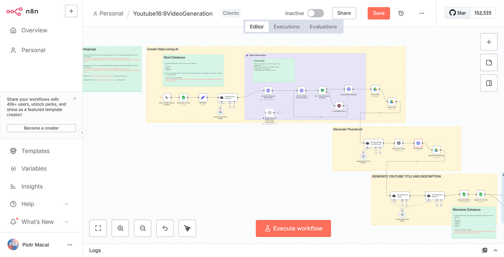

# 🎬 Fully Automated AI Video Generation Pipeline

---

This workflow is a **fully automated pipeline** for **YouTube and social media video generation**—from topic intake to YouTube publishing.

It leverages AI models such as FAl.ai, Veo3, or any other video-generation engine to create content automatically. You can easily adapt each underlying **prompt** to suit any **niche, style, or audience**.

---

## 🚀 Features

* **End-to-End Automation:** Handles the entire process from concept to publication.
* **AI-Powered:** Integrates with leading video generation models (FAl.ai, Veo3, etc.).
* **Customizable:** Prompts are designed to be easily modified for any specific need.
* **Multi-Platform:** Designed for both YouTube and general social media use.

---
