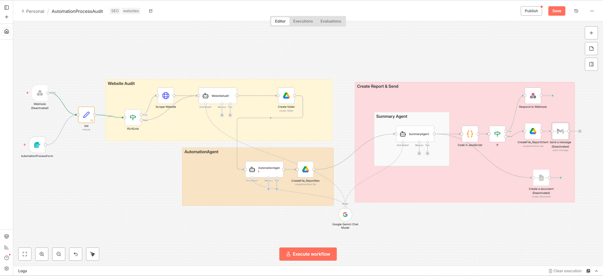

# n8n Automation Process Audit

An n8n workflow designed to perform a complete website and automation audit, generating structured reports with SEO, technical, and process-level recommendations.

## Workflow Overview

The workflow is divided into clear, logical stages:

1. **Trigger & Input**
   - Webhook or form trigger
   - Input validation (website URL, audit parameters)

2. **Website Audit**
   - Website scraping
   - Content and structure analysis
   - Automatic creation of a dedicated Google Drive folder for the audit

3. **Automation Agent**
   - Business and process automation analysis
   - AI-generated developer-focused audit report

4. **Summary & Report Delivery**
   - AI summary agent (client-friendly version)
   - JavaScript data cleanup and formatting
   - Conditional logic (IF nodes)
   - Final report generation (Google Drive / document)
   - Optional email delivery to the client

## Tech Stack

- **n8n**
- **AI Agents (LLM / Google Gemini)**
- **Google Drive**
- **JavaScript (Code node)**
- **Webhooks & Forms**

## Use Cases

- SEO and technical website audits  
- Business process and automation audits  
- Client-ready AI-generated reports  
- Foundation for scalable audit or SaaS automation systems  

## Status

Production-ready, modular workflow (some nodes are optional or disabled depending on deployment).
