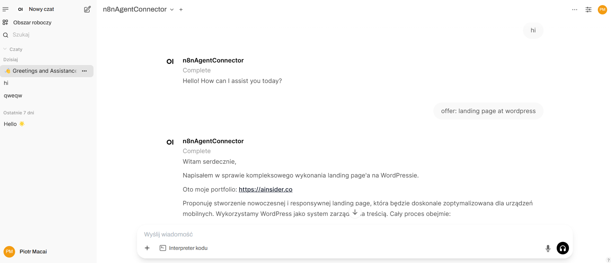
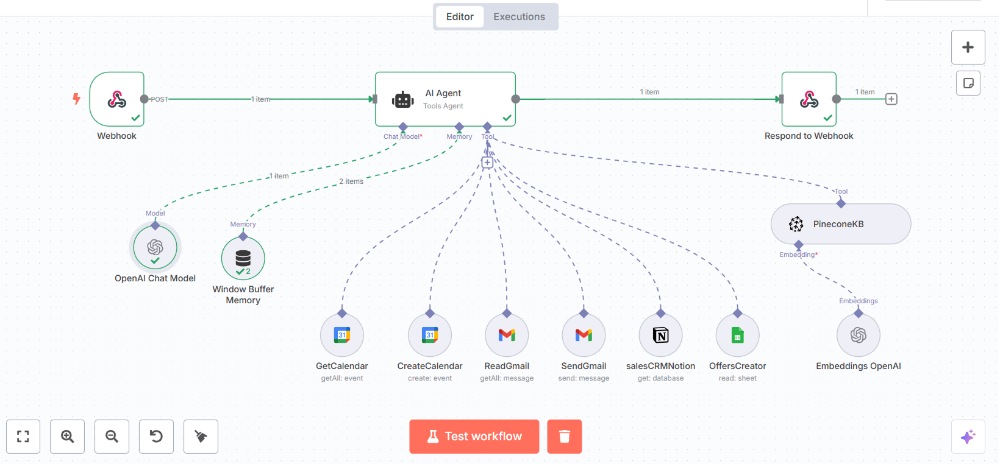

# 🔗 OpenWebUI ↔️ n8n Webhook Integration

This project demonstrates how to connect **OpenWebUI** with a **custom `n8n` Agent** using webhooks for both input and output handling. It includes a Python-based `Pipe` class for sending messages from OpenWebUI to an `n8n` workflow and returning structured responses.

---
  
*OpenWebUI interface*

---

## 🧠 What It Does

- Captures user messages from OpenWebUI.
- Sends the latest message to an `n8n` webhook.
- Waits for a structured response from `n8n`.
- Updates the OpenWebUI conversation with the `n8n` output.
- Emits real-time status updates in the UI (in-progress / complete / errors).

---

  
*Example of n8n workflow that handles OpenWebUI input and returns output via webhook*

---

🚀 Usage
Clone this repo and install it in your OpenWebUI custom modules directory.

Create or import a workflow in n8n that accepts webhook input.

Add your webhook URL and token to the Pipe config.

Start a conversation in OpenWebUI.

👤 Author
Cole Medin
📺 YouTube
🔖 Version: 0.2.0

🛡 License
MIT License. Free to use, modify, and contribute.

🧩 Related Tools
n8n.io – Low-code automation platform

OpenWebUI – UI interface for LLMs like OpenAI/Local models
