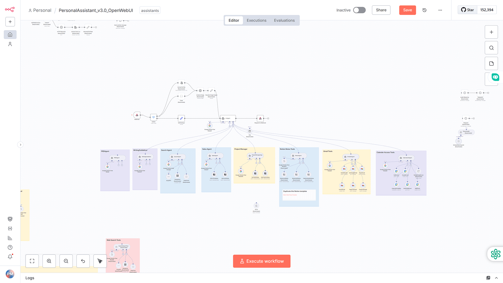

# 🧠 Multimodal Personal AI Assistant via Telegram

---

## 🚀 Overview

This n8n workflow creates a **powerful, multimodal personal AI assistant** accessible directly through **Telegram**. It acts as a central hub for various AI capabilities, allowing you to interact naturally and get complex tasks done, such as generating text, images, or code.

The assistant is triggered by messages sent to a Telegram bot and routes the request to the appropriate AI tool or model based on the user's need.

### Key Features:

* **Telegram Integration:** Easily interact with the AI assistant using simple commands and messages in a Telegram chat.
* **Multimodal Agents:** Capable of handling various request types, including text generation, image creation, and code snippets.
* **Intelligent Routing:** Uses an **`IF`** node to dynamically determine the user's intent and select the correct AI service (e.g., Text/Code Agent, Image Generator).
* **Versatile AI Backends:** Integrates with powerful models (like GPT) and image generation services (like Stable Diffusion or a custom API).
* **Contextual Feedback:** Sends the final output (text, image, or code) back to the user via Telegram.
