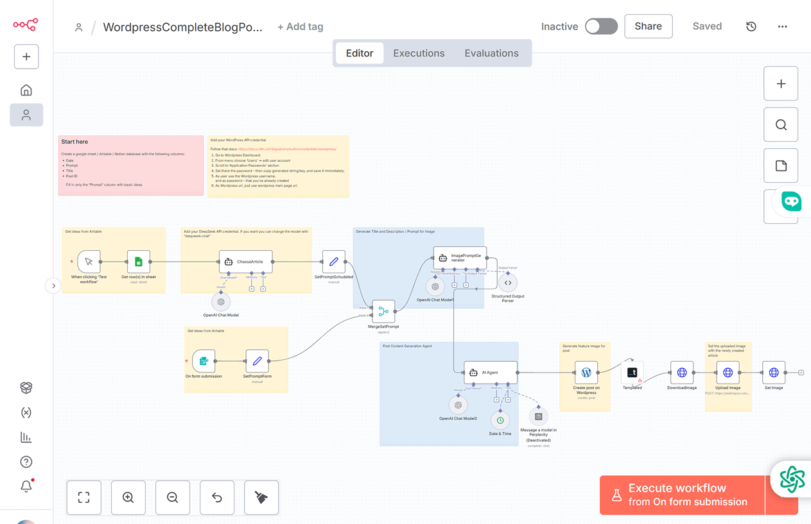

This n8n workflow is a **fully automated, end-to-end pipeline** for generating and publishing complete blog posts to WordPress. It handles everything from topic selection using **AI agents** to generating SEO-friendly content and creating a visually engaging **featured image**, all before publishing the final draft to your site.

---

The diagram above illustrates the complete path from topic intake to post publication.

---

### Key Features:

* **Dual Trigger Modes:** Start the workflow via a manual Airtable/Google Sheet schedule or instantly via a dedicated n8n web form.
* **AI Topic Selection:** Uses a Language Model (LLM) to select the best topic from a list of ideas.
* **SEO-Optimized Content:** An **AI Agent** (using models like GPT-4.1-mini) writes a full article with HTML formatting, structured into chapters, a 120-word introduction, and a 120-word conclusion, all based on a long-tail title.
* **Automated Image Generation:** Creates a unique featured image on the fly using **Templated** and **DownloadImage** nodes based on a short title and description generated by another AI.
* **Complete WordPress Integration:** Creates the draft post, uploads the featured image, and sets it to the post—all via WordPress API calls.

---
